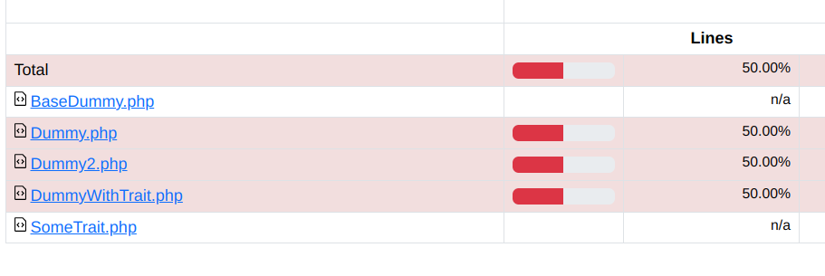
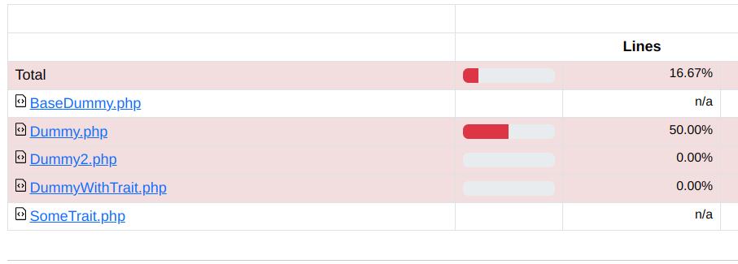

# bugged-phpunit-covers-method-with-trait

## Run test coverage

### xDebug
```
XDEBUG_MODE=coverage php -dpcov.enabled=0 vendor/bin/phpunit --coverage-html=.phpunit.cache/coverage-xdebug
```

### PCOV
```
XDEBUG_MODE=off php -dpcov.enabled=1 vendor/bin/phpunit --coverage-html=.phpunit.cache/coverage-pcov
```


## Case 1 - `DummyWithTrait`'s trait is commented out



## Case 2 - `DummyWithTrait` uses trait

